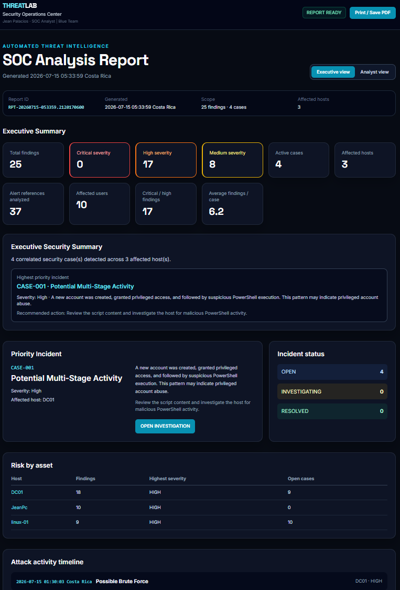
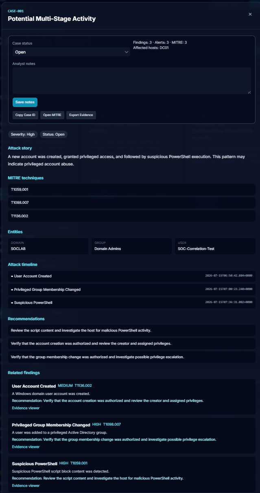
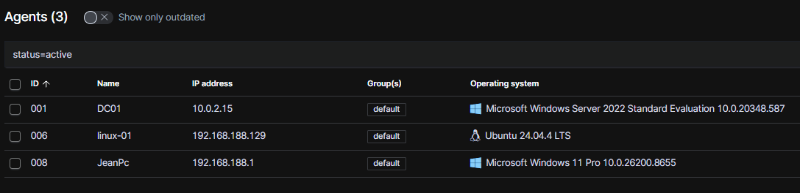
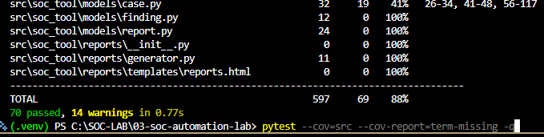

# SOC Automation Lab

A Blue Team security automation platform that transforms Wazuh SIEM telemetry into correlated investigation cases, MITRE ATT&CK mapped findings, and analyst-ready security reports.

Built to simulate a real SOC Level 1 workflow:

**Detection → Triage → Investigation → Reporting**

---

# Project Overview

This project demonstrates an end-to-end Security Operations Center (SOC) investigation workflow using:

- Wazuh SIEM telemetry
- Windows Security Events
- Sysmon monitoring
- Linux audit telemetry
- Custom Python detection logic
- Alert normalization
- Incident correlation
- MITRE ATT&CK enrichment
- Automated investigation reporting

The goal is to replicate how a SOC analyst receives security events, investigates suspicious activity, correlates multiple alerts, and produces actionable findings.

---

# Architecture

```text
Windows Endpoints
Linux Endpoints
        |
        |
   Wazuh Agents
        |
        |
Wazuh Manager + Indexer
        |
        |
Python Alert Ingestion
        |
        |
Alert Normalization
        |
        |
Detection Engine
        |
        |
Correlation Engine
        |
        |
Incident Cases
        |
        |
SOC Investigation Dashboard
```

---

# Project Structure

```text
soc-automation-lab/
│
├── src/
│   └── soc_tool/
│       ├── api/
│       │   └── Wazuh integration
│       │
│       ├── detections/
│       │   └── Detection modules
│       │
│       ├── correlation/
│       │   └── Incident correlation engine
│       │
│       ├── models/
│       │   └── Alert, Finding and Case models
│       │
│       └── reports/
│           └── SOC report generation
│
├── tests/
│   └── Automated validation
│
├── examples/
│   └── Analysis execution examples
│
├── docs/
│   └── screenshots
│
└── README.md
```

# SOC Workflow Demonstrated

```text
Security Event
       |
       v
Alert Collection
       |
       v
Detection Logic
       |
       v
Security Finding
       |
       v
Alert Correlation
       |
       v
Incident Case
       |
       v
Analyst Investigation
       |
       v
Recommendation
```


# Main Capabilities

## SIEM Integration

- Wazuh API integration
- Alert ingestion
- Event normalization
- Security telemetry processing

## Detection Engineering

Custom detection modules for:

- Windows authentication attacks
- Suspicious PowerShell execution
- Account creation
- Privileged group modifications
- Linux SSH attacks
- Linux sudo abuse
- Linux privilege escalation indicators

## Incident Investigation

The platform provides:

- Finding generation
- Evidence extraction
- Related alert tracking
- MITRE ATT&CK mapping
- Incident case correlation
- Analyst recommendations

## Reporting

Automatically generates:

- Executive SOC dashboard
- Analyst investigation view
- Incident timelines
- Risk summaries
- Evidence details

---

# Detection Coverage

## Windows Detections

### Brute Force Authentication

Detection:

- Windows Event ID 4625
- Multiple failed logons

MITRE ATT&CK:

- T1110 - Brute Force


### Suspicious PowerShell

Detection:

- PowerShell Script Block Logging
- Suspicious command execution patterns

MITRE ATT&CK:

- T1059.001 - PowerShell


### User Account Creation

Detection:

- Windows Event ID 4720


### Privileged Group Changes

Detection:

- Windows Event ID 4728
- Privileged Active Directory group membership changes

---

## Linux Detections

Implemented detections:

- SSH brute force attempts
- Failed sudo activity
- Linux user creation
- Privileged group changes

---

# Lab Environment

| System | Role |
|---|---|
| wazuh-01 | Wazuh SIEM Manager + Indexer |
| DC01 | Windows Server 2022 Domain Controller |
| JeanPc | Windows Endpoint |
| linux-01 | Linux monitored endpoint |

---

# SOC Dashboard

The generated report provides both executive and analyst-focused views.

Features:

- Security KPI overview
- Priority incident identification
- Risk by asset analysis
- Incident investigation workflow
- Evidence review
- MITRE ATT&CK references
- Analyst notes and case tracking


## Executive Dashboard




## Incident Investigation




## Wazuh Infrastructure



---

# Automated Testing

The project includes automated validation for:

- Detection logic
- Alert normalization
- Windows and Linux detections
- MITRE ATT&CK mappings
- Incident correlation
- Persistence
- Report generation


Validation results:

```
70 automated tests passed
88% code coverage
597 source statements analyzed
```


Coverage report:



---

# Technologies Used

- Python
- Wazuh
- Sysmon
- Windows Event Logs
- Linux Audit
- MITRE ATT&CK
- SQLite
- pytest
- Git/GitHub

---

# Skills Demonstrated

This project demonstrates practical experience with:

- SOC alert triage
- Blue Team operations
- SIEM monitoring
- Detection engineering
- Incident investigation
- Security automation
- Log analysis
- Event correlation
- MITRE ATT&CK mapping
- Security reporting

---

# Future Improvements

Possible future enhancements:

- Additional detection rules
- Threat intelligence enrichment
- Automated ticket creation
- Email/Slack alert notifications
- Threat hunting modules
- Additional endpoint telemetry sources

---

# Author

## Jean Palacios

Security automation and Blue Team portfolio project focused on SOC operations, SIEM monitoring, detection engineering, and incident investigation.

GitHub:

https://github.com/JeanPalacios-git