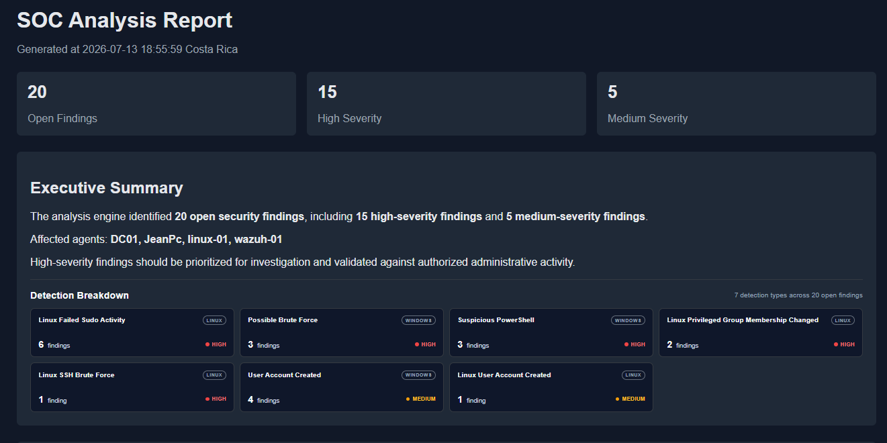
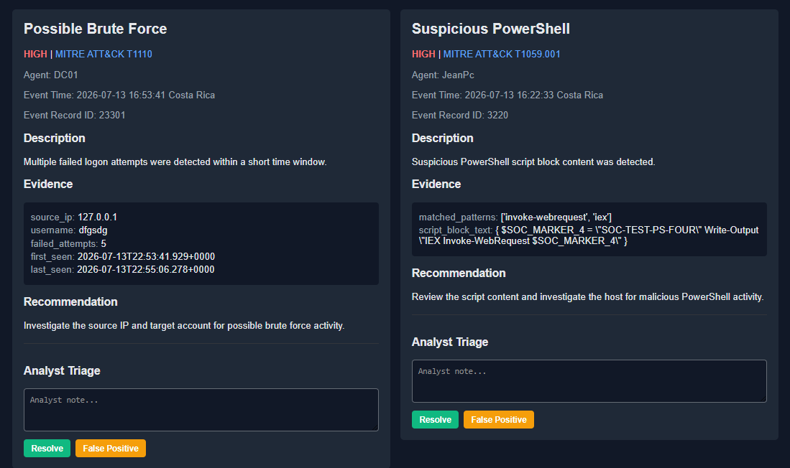
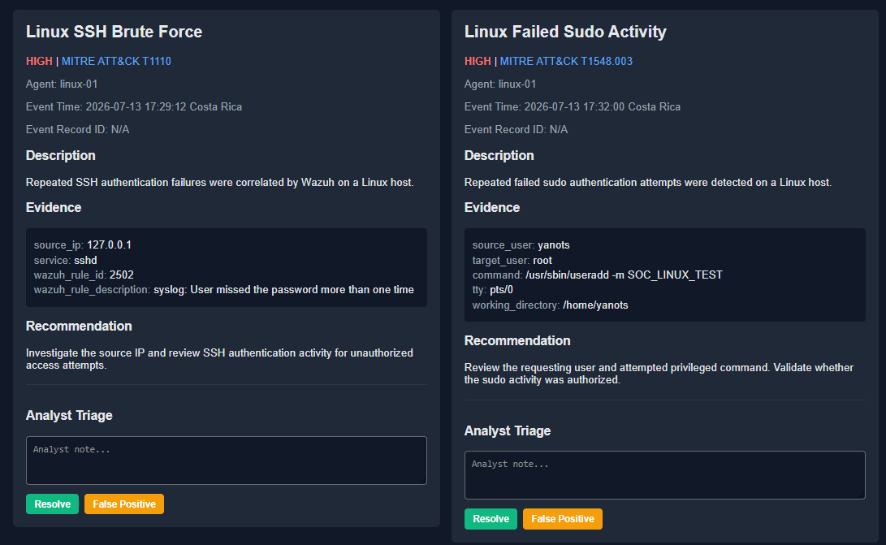
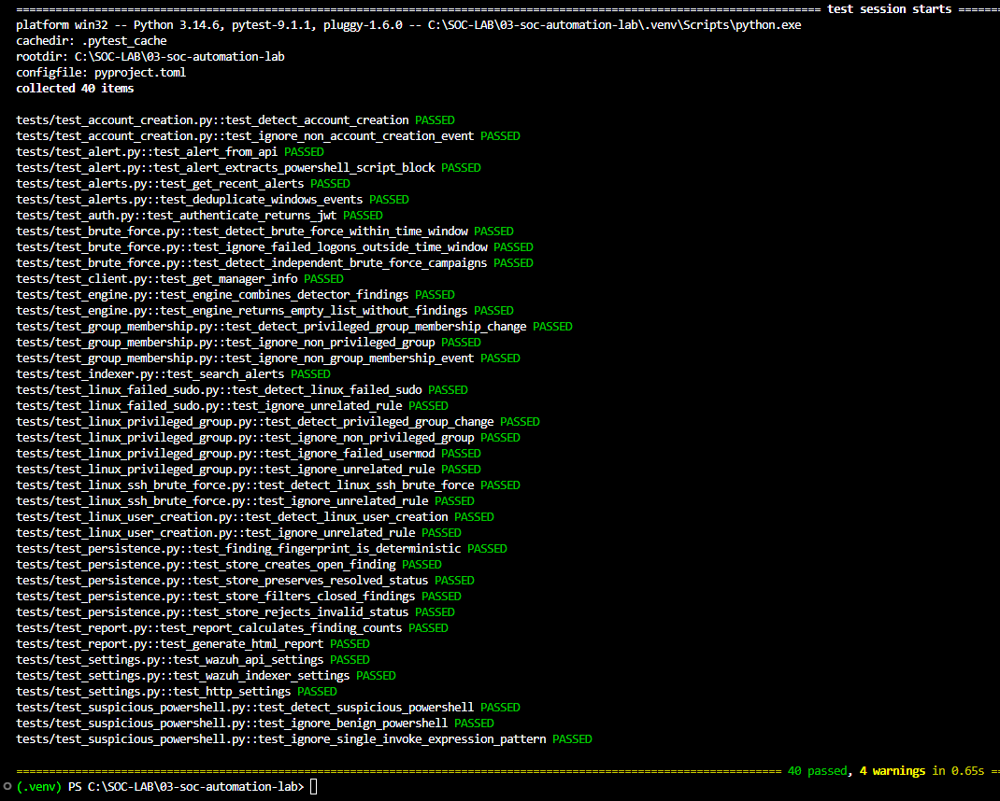

# SOC Automation Lab

Python-based SOC analysis and detection workflow integrated with Wazuh
SIEM telemetry.

The project retrieves security alerts from a Wazuh Indexer, normalizes
Windows and Linux events, executes custom detection logic, persists
analyst findings, and generates an interactive HTML dashboard for
investigation and triage.

## Project Overview

This lab was built to simulate part of a Security Operations Center
Level 1 workflow.

Instead of reviewing isolated SIEM alerts manually, the application
retrieves telemetry from a live Wazuh environment and applies custom
Python detection logic to identify security activity across Windows and
Linux systems.

The goal of the project is to demonstrate a complete detection and
triage workflow:

``` text
Endpoint Activity
        |
        v
Windows Event Logs / Sysmon / Linux Audit Logs
        |
        v
Wazuh Agents
        |
        v
Wazuh Manager and Indexer
        |
        v
Python Alert Ingestion
        |
        v
Alert Normalization
        |
        v
Custom Detection Engine
        |
        v
Finding Persistence
        |
        v
Interactive SOC Analysis Report
        |
        v
Analyst Triage
```

The application is not intended to replace a production SIEM or SOAR
platform.

It is a security engineering lab focused on understanding how SIEM
telemetry can be transformed into actionable security findings through
custom detection and analysis logic.

## Dashboard and Analysis Workflow

The application generates an interactive SOC analysis dashboard from
security telemetry collected through Wazuh.

The dashboard provides a high-level view of open findings, severity
distribution, affected agents, and detection categories across Windows
and Linux systems.

### SOC Analysis Dashboard



The executive summary provides immediate visibility into current
security findings and affected endpoints.

The detection breakdown groups findings by detection type, operating
system, and severity to support faster analyst prioritization.

The dashboard currently displays:

-   Open finding count
-   High-severity finding count
-   Medium-severity finding count
-   Affected Wazuh agents
-   Detection category breakdown
-   Operating system classification
-   Finding severity
-   MITRE ATT&CK mappings
-   Extracted event evidence
-   Investigation recommendations
-   Analyst triage controls

### Windows Security Findings



Windows detection logic analyzes security telemetry for activity such as
failed authentication campaigns and suspicious PowerShell execution.

Each finding includes:

-   Severity classification
-   MITRE ATT&CK technique mapping
-   Affected agent
-   Event timestamp
-   Event record identifier when available
-   Extracted evidence
-   Investigation recommendation
-   Analyst triage controls

The example above demonstrates brute-force detection mapped to MITRE
ATT&CK T1110 and suspicious PowerShell activity mapped to T1059.001.

### Linux Security Findings



Linux telemetry is analyzed for authentication and privilege-related
activity.

Implemented Linux detection scenarios include:

-   SSH authentication failures
-   Failed sudo activity
-   Privileged group membership changes
-   Local user account creation

Linux findings are normalized into the same investigation workflow used
for Windows telemetry, providing a consistent analyst experience across
operating systems.

### Automated Test Suite



The project includes automated tests for detection logic, alert
normalization, persistence, report generation, API configuration, and
analysis workflows.

The current test suite validates 40 test cases covering both positive
detection scenarios and expected benign or unrelated activity.

Key validation areas include:

-   Windows account creation detection
-   Brute-force campaign correlation
-   Independent brute-force campaign separation
-   Suspicious PowerShell detection
-   Privileged Active Directory group changes
-   Linux failed sudo detection
-   Linux privileged group changes
-   Linux SSH brute-force detection
-   Linux user creation detection
-   Finding persistence and status validation
-   HTML report generation
-   Wazuh API and Indexer configuration

This testing approach helps verify that detection logic identifies
expected security activity while ignoring unrelated events.

## Lab Environment

The project operates against a dedicated cybersecurity home lab.

### Infrastructure

  System     Role
  ---------- --------------------------------------------------------
  DC01       Windows Server 2022 Active Directory Domain Controller
  JeanPc     Windows endpoint
  linux-01   Linux monitored endpoint
  wazuh-01   Wazuh SIEM infrastructure

### Security Telemetry

The environment collects telemetry from:

-   Windows Security Event Logs
-   Windows PowerShell logging
-   Sysmon
-   Linux syslog
-   Linux authentication activity
-   Linux audit logs
-   Wazuh-generated alerts

Wazuh agents forward endpoint telemetry to the Wazuh infrastructure
where events are processed and indexed.

The Python application retrieves indexed alerts and performs additional
custom detection and correlation.

## Architecture

The project follows a modular architecture separating telemetry
ingestion, data normalization, detection logic, persistence, and
reporting.

``` text
src/
└── soc_tool/
    ├── api/
    │   ├── alerts.py
    │   ├── auth.py
    │   ├── client.py
    │   └── indexer.py
    ├── config/
    │   └── settings.py
    ├── detections/
    │   ├── account_creation.py
    │   ├── brute_force.py
    │   ├── engine.py
    │   ├── group_membership.py
    │   ├── linux_failed_sudo.py
    │   ├── linux_privileged_group.py
    │   ├── linux_ssh_brute_force.py
    │   ├── linux_user_creation.py
    │   ├── persistence.py
    │   └── suspicious_powershell.py
    ├── models/
    │   ├── alert.py
    │   ├── finding.py
    │   └── report.py
    └── reports/
        ├── generator.py
        └── templates/
            └── reports.html
```

### API Layer

The API layer handles communication with Wazuh services.

Responsibilities include:

-   Wazuh API authentication
-   JWT token handling
-   Wazuh Manager communication
-   Wazuh Indexer searches
-   Alert retrieval
-   Indexer availability handling

### Alert Normalization

Raw Wazuh documents can contain different fields depending on the event
source.

The alert model converts retrieved documents into a consistent internal
representation used by the detection engine.

Normalized information can include:

-   Agent name and identifier
-   Rule identifier, description, and level
-   Event timestamp
-   Windows Event ID
-   Event record ID
-   Source IP
-   Username
-   PowerShell script block content
-   Linux audit command data
-   Raw event fields

This allows individual detectors to work with a predictable Python
object instead of directly parsing raw Indexer responses.

### Detection Engine

The analysis engine executes multiple detection modules against
retrieved alerts.

Each detector receives normalized alerts and returns security findings
when detection conditions are met.

The engine combines findings from all registered detection modules into
a unified analysis result.

Conceptually:

``` python
alerts = retrieve_alerts()
findings = analysis_engine.run(alerts)
store_findings(findings)
generate_report(findings)
```

Detection logic remains separated from API communication and report
generation, making individual modules easier to test and extend.

## Implemented Detections

### Possible Brute Force

Detects multiple failed Windows authentication events occurring within a
defined time window.

Relevant telemetry:

-   Windows Event ID 4625
-   Source IP
-   Target username
-   Event timestamp

MITRE ATT&CK:

``` text
T1110 - Brute Force
```

The detector correlates authentication failures and separates
independent brute-force campaigns instead of combining unrelated
activity into a single finding.

### Suspicious PowerShell

Analyzes PowerShell script block content for suspicious execution
patterns.

Detection examples include:

-   `Invoke-WebRequest`
-   `iex`
-   Download-related execution patterns
-   Encoded command indicators

MITRE ATT&CK:

``` text
T1059.001 - PowerShell
```

The detector includes negative test scenarios to reduce detections on
unrelated PowerShell activity.

### User Account Created

Detects Windows user account creation events.

Relevant telemetry:

``` text
Windows Event ID 4720
```

The analyst recommendation focuses on validating whether account
creation was authorized and reviewing the creator and assigned
privileges.

### Privileged Group Membership Changed

Detects changes involving privileged Active Directory groups.

The detector distinguishes privileged group changes from unrelated group
membership activity to identify changes that may affect administrative
access or domain security.

### Linux Failed Sudo Activity

Detects repeated failed sudo authentication activity on monitored Linux
systems.

Relevant evidence can include:

-   Source user
-   Target user
-   Attempted command
-   TTY
-   Working directory

MITRE ATT&CK:

``` text
T1548.003 - Sudo and Sudo Caching
```

### Linux Privileged Group Membership Changed

Detects Linux account changes involving privileged groups such as
`sudo`.

The detector reviews audit telemetry associated with user and group
modification commands and ignores unrelated or failed activity.

### Linux SSH Brute Force

Detects repeated SSH authentication failures correlated by Wazuh on a
monitored Linux endpoint.

Relevant evidence can include:

-   Source IP
-   SSH service
-   Wazuh rule ID
-   Wazuh rule description

MITRE ATT&CK:

``` text
T1110 - Brute Force
```

### Linux User Account Created

Detects local Linux user creation activity from `useradd` telemetry.

The finding exposes account creation evidence for analyst validation and
review of whether the new account was authorized.

## Finding Model

Detectors return normalized findings instead of directly generating
HTML.

A finding contains investigation-focused information such as:

-   Title
-   Severity
-   MITRE ATT&CK technique
-   Agent
-   Event time
-   Event record ID
-   Description
-   Evidence
-   Recommendation

This design allows detection logic to remain independent from
presentation logic.

## Finding Persistence

Detected findings are stored locally in SQLite.

Persistence supports:

-   Finding deduplication
-   Deterministic finding fingerprints
-   Open finding storage
-   Resolved status
-   False-positive status
-   Analyst notes
-   Filtering of closed findings

This prevents the same event from continuously appearing as a new
finding during repeated analysis runs.

## Analyst Triage Workflow

The generated dashboard includes basic analyst triage functionality.

For each finding, the analyst can:

-   Review the detection description
-   Inspect extracted evidence
-   Review the MITRE ATT&CK mapping
-   Read the investigation recommendation
-   Add an analyst note
-   Mark the finding as resolved
-   Mark the finding as a false positive

The workflow is intentionally modeled around entry-level SOC
investigation tasks.

## Investigation Playbooks

The repository includes analyst-focused investigation playbooks designed
to support repeatable SOC Level 1 triage.

Available playbooks:

  ---------------------------------------------------------------------
  Playbook                           Investigation Focus
  ---------------------------------- ----------------------------------
  `brute-force.md`                   Repeated Windows and Linux
                                     authentication failures

  `persistence.md`                   Account, privilege, and scripting
                                     activity that may support
                                     continued access

  `privilege-escalation.md`          Privileged group changes and
                                     failed privileged command activity

  `user-creation.md`                 Windows and Linux account creation
                                     events
  ---------------------------------------------------------------------

Each playbook provides:

-   Detection context
-   Initial triage steps
-   Investigation questions
-   Escalation criteria
-   Recommended response actions
-   False-positive considerations
-   Analyst closure documentation requirements

The playbooks connect automated findings with a practical analyst
investigation workflow. Their purpose is to document what a SOC analyst
should review after the detection engine identifies potentially
suspicious activity.

## Interactive Reporting

The application generates an HTML SOC analysis report.

Report features include:

-   Executive summary
-   Finding statistics
-   Detection breakdown
-   Windows and Linux classification
-   Severity indicators
-   MITRE ATT&CK references
-   Finding sorting
-   Responsive finding grid
-   Evidence containers
-   Investigation recommendations
-   Analyst triage forms

Findings can be sorted by criteria including operating system and other
report-defined ordering options.

## Installation

### Requirements

-   Python 3
-   Access to a Wazuh environment
-   Wazuh API credentials
-   Wazuh Indexer credentials

Clone the repository:

``` bash
git clone https://github.com/JeanPalacios-git/soc-automation-lab.git
cd soc-automation-lab
```

Create a virtual environment:

``` bash
python -m venv .venv
```

Activate the environment.

Windows PowerShell:

``` powershell
.\.venv\Scripts\Activate.ps1
```

Install the project:

``` bash
pip install -e .
```

## Configuration

Copy the example environment file:

``` bash
cp .env.example .env
```

On Windows PowerShell:

``` powershell
Copy-Item .env.example .env
```

Configure the required Wazuh values in `.env`.

Example:

``` env
WAZUH_HOST=CHANGE_ME
WAZUH_PORT=55000
WAZUH_USERNAME=CHANGE_ME
WAZUH_PASSWORD=CHANGE_ME

WAZUH_INDEXER_HOST=CHANGE_ME
WAZUH_INDEXER_PORT=9200
WAZUH_INDEXER_USERNAME=CHANGE_ME
WAZUH_INDEXER_PASSWORD=CHANGE_ME

VERIFY_SSL=false
REQUEST_TIMEOUT=30
```

Do not commit real credentials.

The `.env` file is excluded through `.gitignore`.

## Running the Analysis

Run the analysis workflow:

``` bash
python examples/run_analysis.py
```

The workflow retrieves recent Wazuh alerts, normalizes events, executes
detection modules, stores findings, and generates the SOC analysis
report.

The local launcher can also be used where applicable:

``` bash
python launcher.py
```

## Running Tests

Run the local test suite:

``` bash
pytest -v --disable-warnings
```

The current suite contains 40 passing tests.

Integration tests that require live Wazuh infrastructure are separated
from the default local test workflow.

## Project Structure

``` text
soc-automation-lab/
├── docs/
│   └── screenshots/
├── examples/
│   └── run_analysis.py
├── playbooks/
│   ├── brute-force.md
│   ├── persistence.md
│   ├── privilege-escalation.md
│   └── user-creation.md
├── src/
│   └── soc_tool/
├── tests/
├── .env.example
├── .gitignore
├── LICENSE
├── README.md
├── launcher.py
└── pyproject.toml
```

## Security Considerations

This repository does not intentionally contain production credentials or
secrets.

Sensitive configuration is loaded from environment variables.

The repository uses:

-   `.env` exclusion through `.gitignore`
-   Placeholder credentials in `.env.example`
-   GitHub noreply commit identity
-   Private lab addressing only where required for test or configuration
    examples

Users should never commit:

-   Wazuh passwords
-   API tokens
-   Private keys
-   JWT tokens
-   Production credentials

## Skills Demonstrated

This project demonstrates practical experience with:

-   SOC alert triage
-   Wazuh SIEM
-   Windows Security Event Logs
-   Sysmon telemetry
-   PowerShell logging
-   Linux security telemetry
-   Linux audit logs
-   Active Directory security monitoring
-   MITRE ATT&CK mapping
-   Python security automation
-   Detection engineering fundamentals
-   Event correlation
-   Alert normalization
-   SQLite persistence
-   Automated testing with pytest
-   HTML reporting
-   Git and GitHub workflow

## Related Projects

This project is part of a larger SOC lab environment.

Related repositories include:

-   `active-directory-enterprise-lab`
-   `enterprise-siem-lab`

The Active Directory lab provides Windows domain infrastructure and
security events.

The Wazuh SIEM lab provides centralized telemetry collection and
monitoring.

SOC Automation Lab consumes this telemetry and applies custom detection,
correlation, persistence, reporting, and analyst triage logic.

## Future Improvements

Potential future improvements include:

-   Additional detection modules
-   Configurable detection thresholds
-   Detection configuration files
-   Expanded Linux telemetry analysis
-   Additional MITRE ATT&CK enrichment
-   Finding search and filtering
-   Report export options
-   REST API endpoints
-   Improved analyst case management
-   Additional correlation logic

## License

This project is released under the MIT License.

See `LICENSE` for the full license text.

## Disclaimer

This project was created for cybersecurity education, defensive security
research, and portfolio demonstration in a controlled lab environment.

All security testing and event generation should be performed only on
systems you own or are explicitly authorized to test.

## Author

**Jean Palacios**

Cybersecurity student focused on SOC analysis, Blue Team operations,
SIEM monitoring, and security automation.
